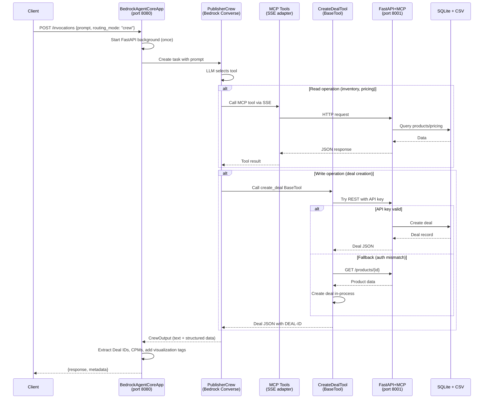

# AgentCore Architecture

The AgentCore deployment wraps the existing seller agent in a `BedrockAgentCoreApp` container without modifying community-maintained code. All AgentCore-specific files live in `src/ad_seller/interfaces/agentcore/` and `patches/`.

---

## Design Principles

1. **No community code modifications** — Agent, crew, flow, and engine code is untouched. Tools and patches are injected at runtime.
2. **Same data, different interface** — The AgentCore runtime uses the same CSV adapter, pricing engine, and deal creation logic as the Docker/ECS deployment.
3. **Two routing paths** — `crew` mode for agentic LLM behavior, `chat` mode for deterministic keyword routing. Both share the same storage and product catalog.

---

## Component Map

```
src/ad_seller/interfaces/agentcore/
├── http_main.py          # BedrockAgentCoreApp entrypoint
├── crew_tools.py         # BaseTool subclasses for CrewAI
├── mcp_main.py           # MCP-only entrypoint (standalone)
├── main.py               # Unified entrypoint (mode selection)
└── __init__.py

patches/
├── crewai_bedrock_fix.py # Bedrock Converse API compatibility
└── __init__.py

infra/aws/agentcore/
├── deploy.sh             # Build + deploy via agentcore CLI
├── requirements.txt      # Python dependencies for container
├── agentcore-network.yaml # CloudFormation (VPC mode)
└── main-agentcore.yaml   # CloudFormation (root stack)
```

---

## Data Flow — Crew Mode



---

## Tool Architecture

### Read Tools (MCP)

Read operations use `MCPServerAdapter` with SSE transport to auto-discover tools from the MCP server running on localhost:8001.

| Tool | MCP Name | Endpoint |
|------|----------|----------|
| List Products | `list_products` | `GET /products` |
| Get Product Details | `get_product_details` | `GET /products/{id}` |
| Get Pricing | `get_pricing` | `POST /pricing` |
| Discover Inventory | `discover_inventory` | `POST /discovery` |
| Get Rate Card | `get_rate_card` | `GET /products` (grouped) |
| Get Deal Performance | `get_deal_performance` | `GET /api/v1/deals/{id}/performance` |

### Write Tools (BaseTool)

Write operations use a hand-written `CreateDealTool` (BaseTool subclass) instead of the MCP `create_deal_from_template` tool. Reasons:

1. The MCP tool description is minimal — the LLM is less confident executing it
2. The MCP endpoint requires auth headers the SSE adapter doesn't send
3. The BaseTool has an enriched description with explicit authorization language
4. The BaseTool includes an in-process fallback that bypasses REST auth

### Tool Filter

The `CREW_MCP_TOOLS` env var controls which MCP tools are loaded. This reduces tool overload so the LLM reliably selects the right tool. Default:

```
list_products,get_product_details,get_pricing,discover_inventory,get_rate_card,search_media_kit,get_deal_performance
```

`create_deal_from_template` is excluded — the BaseTool `CreateDealTool` handles deal creation.

---

## Storage

AgentCore containers have ephemeral filesystems. The runtime uses:

- **SQLite in-memory** (`sqlite:///:memory:`) for session state and product catalog
- **CSV adapter** loads products from `data/csv/samples/aws_workshop/` at startup
- No persistent storage across invocations — each cold start reloads from CSV

For production with persistent storage, set `STORAGE_TYPE=hybrid` with Aurora PostgreSQL and ElastiCache Redis (requires VPC mode).

---

## Bedrock Converse Integration

The CrewAI `PublisherCrew` runs with Bedrock's native Converse API via `LLM(model="bedrock/...")`. Two compatibility patches are required:

### Patch 1: Orphaned Tool Block Sanitization

Bedrock Converse requires every `toolUse` block to have a matching `toolResult` in the next message. CrewAI's agent executor can leave orphaned blocks from previous iterations. The patch strips unmatched blocks before each API call.

### Patch 2: Tool Argument Extraction

CrewAI's `_parse_native_tool_call` reads `func_info.get("arguments", "{}")` which returns the truthy default string `"{}"`, so the `or tool_call.get("input", {})` fallback never evaluates. The patch intercepts Bedrock-format dicts (identified by `toolUseId` key) and reads `input` directly.

Both patches are in `patches/crewai_bedrock_fix.py` and applied automatically on first crew invocation.

---

## Relationship to ECS Deployment

The AgentCore deployment is an alternative to the existing ECS/Docker deployment, not a replacement.

| Aspect | ECS/Docker | AgentCore |
|--------|-----------|-----------|
| Container orchestration | ECS Fargate | AgentCore managed |
| LLM provider | Anthropic API (direct) | Bedrock Converse (native) |
| Storage | Aurora + Redis | SQLite in-memory (or Aurora via VPC) |
| Scaling | ECS auto-scaling | AgentCore microVM-per-session |
| Deploy tool | CloudFormation / Terraform | `agentcore` CLI + CodeBuild |
| Cold start | ~5s (ECS) | ~15-30s (container + FastAPI) |
| Code changes | None | `interfaces/agentcore/` + `patches/` only |
