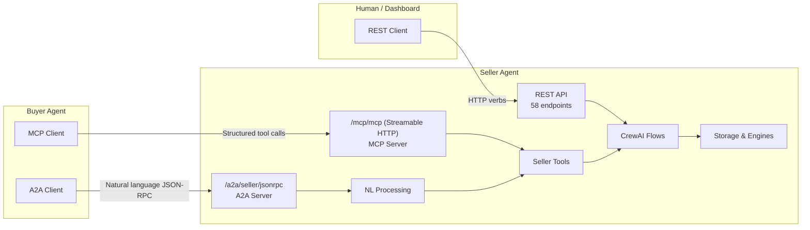
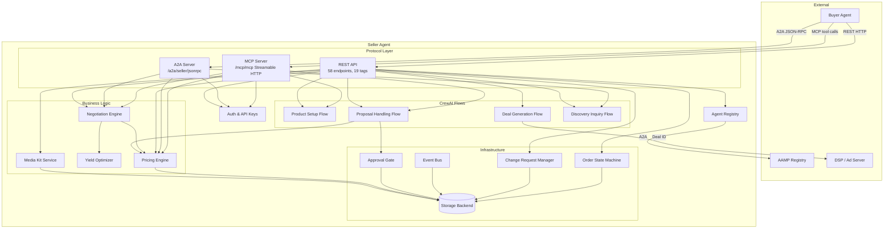
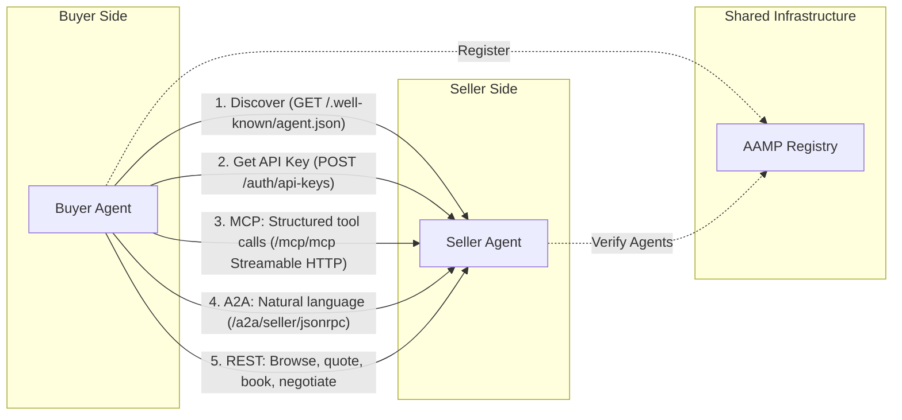

# Architecture Overview

The Ad Seller Agent is a layered system built on FastAPI with CrewAI agent flows for intelligent decision-making.

## Access Paths

The seller agent exposes three protocols for different client types:

| Path | Flow | Best For |
|------|------|----------|
| **MCP** | Buyer Agent &rarr; MCP &rarr; Seller Tools &rarr; CrewAI Flows &rarr; Storage/Engines | Automated workflows, deterministic tool calls |
| **A2A** | Buyer Agent &rarr; A2A &rarr; NL Processing &rarr; Seller Tools &rarr; CrewAI Flows | Discovery, negotiation, conversational queries |
| **REST** | Human/Dashboard &rarr; REST API &rarr; CrewAI Flows &rarr; Storage/Engines | Operator dashboards, non-agent clients |

See [MCP Protocol](../api/mcp.md), [A2A Protocol](../api/a2a.md), and [API Overview](../api/overview.md) for details on each.

## System Architecture

## Components

### API Layer

**FastAPI application** with 58 endpoints across 19 OpenAPI tags. Handles HTTP routing, request validation, authentication, and response serialization. See [API Overview](../api/overview.md).

### Authentication and Agent Registry

- **API Key Service** --- Creates, validates, and revokes API keys. Keys carry buyer identity (seat, agency, advertiser).
- **Agent Registry** --- Tracks buyer agents with trust levels (unknown, registered, approved, preferred, blocked). Integrates with AAMP (IAB Agent & API Management Protocol) for cross-registry verification. See [Authentication](../api/authentication.md).

### Business Logic Engines

- **PricingRulesEngine** --- Calculates tiered pricing with buyer-context-aware discounts (tier, volume, deal type). Deterministic, no LLM calls.
- **NegotiationEngine** --- Manages multi-round price negotiation with strategy-based responses. Strategies are mapped from buyer access tier. See [Negotiation](../integration/negotiation.md).
- **YieldOptimizer** --- Provides floor price guidance and concession calculations to the negotiation engine.
- **MediaKitService** --- Manages the three-layer package catalog (ad-server sync, curated packages, dynamic assembly).

### CrewAI Flows

- **ProductSetupFlow** --- Initializes the product catalog from configuration.
- **ProposalHandlingFlow** --- Evaluates buyer proposals using AI agents and routes to acceptance, rejection, or counter-offer.
- **DealGenerationFlow** --- Converts accepted proposals into deals with OpenRTB parameters.
- **DiscoveryInquiryFlow** --- Handles natural-language inventory queries from buyers.

### Infrastructure

- **Event Bus** --- Emits and stores events for all system activity. 21 event types across 7 categories. See [Event Bus](../event-bus/overview.md).
- **Order State Machine** --- Formal state machine with 12 states and 20 transitions. Full audit trail. See [Order Lifecycle](../state-machines/order-lifecycle.md).
- **Change Request Manager** --- Handles post-deal modifications with severity classification and approval routing. See [Change Requests](../api/change-requests.md).
- **Approval Gate** --- Human-in-the-loop approval workflow for proposals and high-value decisions.
- **Storage Backend** --- Pluggable storage with key-prefix convention. SQLite and Redis backends. See [Storage](storage.md).

## Ecosystem

The seller agent is one side of the IAB Tech Lab Agent Ecosystem. See the [Buyer Agent architecture](https://iabtechlab.github.io/buyer-agent/architecture/overview/) for the other side.

### Deployment Options

The seller agent supports two deployment targets:

| Target | Infrastructure | LLM Provider | Guide |
|--------|---------------|-------------|-------|
| **ECS/Docker** | CloudFormation or Terraform, Aurora + Redis | Anthropic API (direct) | [Deployment](../guides/deployment.md) |
| **AgentCore** | Managed by Bedrock AgentCore, SQLite in-memory | Bedrock Converse (native) | [AgentCore Deployment](../guides/agentcore-deployment.md) |

Both targets use the same business logic, pricing engine, and deal creation code. The AgentCore deployment adds `interfaces/agentcore/` and `patches/` without modifying community code. See [AgentCore Architecture](agentcore.md) for the component map and data flow.

